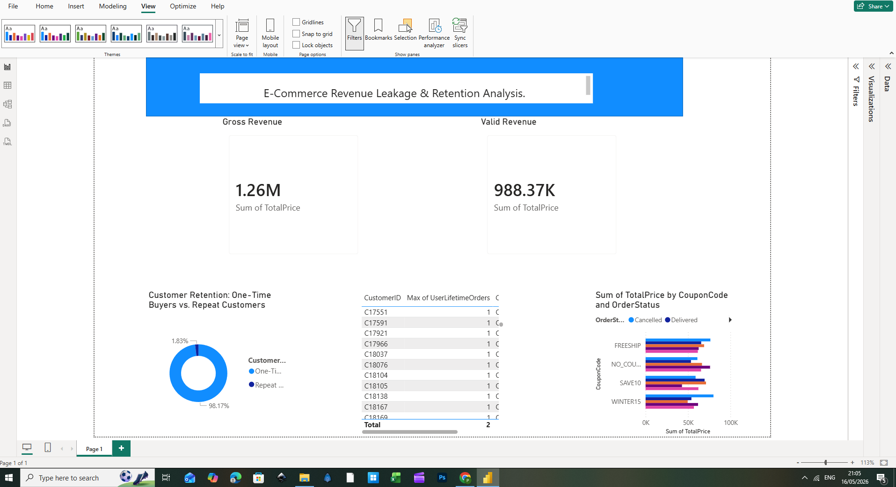

# E-Commerce Revenue Leakage & Retention Analysis

## 📌 Project Overview
This project investigates key operational inefficiencies for an e-commerce platform, specifically focusing on customer retention mechanics ("The Leaky Bucket") and promotional code vulnerabilities ("Coupon Cannibalization"). Using a hybrid workflow of Python for data engineering and Power BI for executive dashboard design, this analysis uncovers critical vulnerabilities costing the business over $271K in lost revenue.

## 🛠️ Tech Stack & Skills
* **Data Engineering & Cleaning:** Python (Pandas)
* **Data Visualization:** Power BI Desktop
* **Analytics Frameworks:** Cohort Segmentation, Revenue Validation Logic, Filter Contexts

---

## 🔍 Key Findings & Business Insights

### 1. The "Leaky Bucket" Retention Crisis
* **Metric:** 98.17% One-Time Buyers vs. 1.83% Repeat Customers.
* **Strategic Insight:** The business suffers from a severe retention deficit. Growth is entirely dependent on continuous, high-cost customer acquisition. Without an immediate post-purchase re-engagement or loyalty strategy, marketing spend is being heavily diluted.

### 2. Coupon Cannibalization & Revenue Leakage
* **Metric:** Gross Revenue ($1.26M) vs. Valid Revenue ($988.37K) — a loss of **$271.63K**.
* **Strategic Insight:** Massive transactional volume is being tied up in orders that ultimately face cancellation. 
* **The "Smoking Gun":** The `WINTER15` promotional code is heavily correlated with these cancelled orders, indicating either a technical glitch in the checkout funnel, drop-shipper exploitation, or highly non-committal consumer behavior triggered by the discount.

---

## 📊 Dashboard Preview

---

## 🛠️ Methodology & Implementation

### Phase 1: Python Data Engineering
Using Python, the raw e-commerce transactional data was processed to engineer custom business logic fields:
* `UserLifetimeOrders`: Aggregated order counts per unique customer.
* `CustomerSegment`: Conditional logic separating users into `One-Time Buyer` or `Repeat Customer`.
* `IsRevenueValid`: A boolean flag mapping valid transactional statuses vs. cancellations to isolate actual retained cash.

### Phase 2: Power BI Visualization
* Constructed a high-density, executive-ready dashboard utilizing a clean grid hierarchy.
* Eliminated default visual clutter (removing redundant legends and moving detail labels inline) to maximize data readability.
* Implemented unified "signal colors" (Coral/Red for leakage metrics, Navy/Teal for health metrics) to streamline visual processing for stakeholder decision-making.

---

## 🚀 Actionable Recommendations
1. **Promotional Policy Audit:** Restrict or temporarily suspend the `WINTER15` coupon code to investigate the root cause of its high cancellation rate.
2. **Retention Funnel Implementation:** Shift a percentage of the customer acquisition budget toward email remarketing and automated loyalty incentives targeting first-time buyers within 14 days of their initial purchase.
